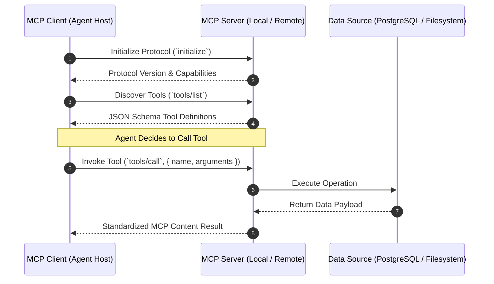

# Anthropic Model Context Protocol (MCP) Architectural Guide

Before the introduction of the **Model Context Protocol (MCP)**, connecting AI models to enterprise databases, repositories, and SaaS tools required custom integration code for every combination of LLM provider and tool vendor.

Anthropic introduced **MCP** as an open standard (analogous to the Language Server Protocol for IDEs) that allows AI agents to securely connect to external tools, inspect resources, and stream data over standardized **JSON-RPC 2.0 transports**.

---

## 1. Core Architecture & Mental Model

MCP establishes a clear client-server architecture:
1. **MCP Host / Client**: The AI application (such as an autonomous agent runtime or Claude Desktop) that initiates sessions, discovers capabilities, and requests tool executions.
2. **MCP Server**: A lightweight process exposing Tools, Resources (readable file/database contents), and Prompts over a standardized transport.
3. **Transports**:
   - **Stdio Transport**: Sub-process communication over standard input/output (ideal for local tooling and desktop agents).
   - **HTTP with Server-Sent Events (SSE)**: Remote networking for cloud-hosted microservices.



---

## 2. Installation & Quick Setup

```bash
# TypeScript MCP SDK
npm install @modelcontextprotocol/sdk zod

# Python MCP SDK
pip install mcp
```

---

## 3. Recommended Production Folder Structure

```text
mcp_server/
├── src/
│   ├── tools/
│   │   ├── postgresTools.ts   # Database query tools
│   │   └── fileTools.ts       # Workspace inspection tools
│   ├── resources/
│   │   └── schemaResource.ts  # Database schema resource viewer
│   └── server.ts              # MCP Server entrypoint & Stdio transport
└── package.json
```

---

## 4. Complete, Runnable Starter Project in TypeScript

### Creating an MCP Tool Server (`src/server.ts`):

```typescript
import { Server } from "@modelcontextprotocol/sdk/server/index.js";
import { StdioServerTransport } from "@modelcontextprotocol/sdk/server/stdio.js";
import { CallToolRequestSchema, ListToolsRequestSchema } from "@modelcontextprotocol/sdk/types.js";
import { z } from "zod";

// 1. Initialize MCP Server
const server = new Server(
  { name: "production-infra-mcp-server", version: "1.0.0" },
  { capabilities: { tools: {} } }
);

// 2. Define Tool List Handler
server.setRequestHandler(ListToolsRequestSchema, async () => {
  return {
    tools: [
      {
        name: "get_cluster_status",
        description: "Returns the health and active node count of a Kubernetes cluster.",
        inputSchema: {
          type: "object",
          properties: {
            clusterName: { type: "string", description: "Target cluster identifier" },
          },
          required: ["clusterName"],
        },
      },
    ],
  };
});

// 3. Define Tool Execution Handler
server.setRequestHandler(CallToolRequestSchema, async (request) => {
  if (request.params.name === "get_cluster_status") {
    const cluster = String(request.params.arguments?.clusterName || "unknown");
    return {
      content: [
        {
          type: "text",
          text: JSON.stringify({
            cluster,
            status: "HEALTHY",
            activeNodes: 12,
            cpuUtilization: "64.2%",
          }),
        },
      ],
    };
  }

  throw new Error(`Tool not found: ${request.params.name}`);
});

// 4. Connect Transport
async function start() {
  const transport = new StdioServerTransport();
  await server.connect(transport);
  console.error("Infra MCP Server running over Stdio transport.");
}

start().catch(console.error);
```

---

## 5. Architectural Tradeoffs Matrix

| Feature | Legacy Custom Tool Wrappers | Anthropic Model Context Protocol (MCP) |
| :--- | :--- | :--- |
| **Interoperability** | Locked to specific LLM framework | **Universal across any MCP-compliant Client** |
| **Transport Layer** | Hardcoded inside process | **Decoupled over Stdio or HTTP/SSE** |
| **Security & Isolation** | Tools share application memory | **Sandboxed in dedicated process boundaries** |
| **Dynamic Discovery** | Static code imports | **Runtime negotiation via `tools/list`** |

---

## 6. When to Use vs. When to Avoid

### Choose Model Context Protocol When:
- You want to author reusable tool integrations that work across multiple agent frameworks, Claude Desktop, and CLI tools.
- You need isolated tool processes running with independent security permissions.

### Avoid Model Context Protocol When:
- You are writing simple, in-memory string formatting helpers that don't need process isolation or cross-platform standardization.
