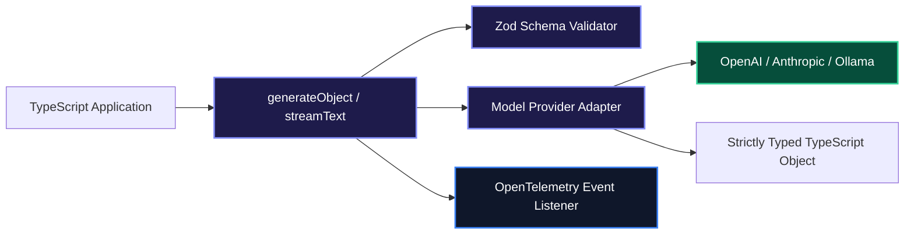

# ModelFusion Architectural Guide: The TypeScript Library for Multimodal AI

When writing TypeScript applications that interact with multiple foundation models (text generation, speech-to-text, vector embeddings, image synthesis), developers frequently run into mismatched abstractions, lack of type safety, and inconsistent error handling.

**ModelFusion** is an open-source, vendor-neutral TypeScript library that provides unified, type-safe functions for **text generation, structured object extraction, streaming, embeddings, and tool calling** without heavyweight opinionated abstractions.

---

## 1. Core Architecture & Mental Model

ModelFusion is designed around composable, non-opinionated functional primitives:

1. **Standardized Operations**: Unified polymorphic functions such as `generateText()`, `streamText()`, `generateObject()`, and `embedMany()`.
2. **Model Providers**: Vendor-neutral wrappers for OpenAI, Anthropic, Mistral, Ollama, Cohere, and Hugging Face.
3. **Zod Structured Validation**: Strict schema parsing using Zod with automated retries and schema repair.
4. **Built-in Observability**: Native OpenTelemetry and logging hooks with zero external dependencies.



---

## 2. Installation & Quick Setup

```bash
npm install modelfusion zod
```

---

## 3. Recommended Production Folder Structure

```text
src/
├── schemas/
│   └── incidentSchema.ts   # Zod data contracts
├── models/
│   └── providerFactory.ts  # Configured ModelFusion model instances
├── services/
│   └── extractorService.ts # Business logic calling generateObject
└── index.ts
```

---

## 4. Complete, Runnable Starter Project in TypeScript

Below is a complete TypeScript script utilizing ModelFusion for structured entity extraction with Zod schemas and automatic error validation:

```typescript
import { openai, generateObject, zodSchema } from "modelfusion";
import { z } from "zod";

// 1. Define Strict Zod Target Schema
const CodeSecurityAuditSchema = z.object({
  vulnerabilitiesDetected: z.boolean(),
  severity: z.enum(["LOW", "MEDIUM", "HIGH", "CRITICAL"]),
  findings: z.array(
    z.object({
      file: z.string(),
      lineRange: z.string(),
      issue: z.string(),
      remediation: z.string(),
    })
  ),
  overallScore: z.number().min(0).max(100),
});

// 2. Define Model Instance
const model = openai
  .ChatTextGenerator({
    model: "gpt-4o-mini",
    temperature: 0.0,
  })
  .asObjectGenerationModel(
    zodSchema(CodeSecurityAuditSchema)
  );

// 3. Execute Structured Extraction
async function auditSnippet(codeSnippet: string) {
  const auditReport = await generateObject({
    model,
    prompt: [
      openai.ChatMessage.system("You are an expert AppSec code auditor. Inspect the snippet and output a security scorecard."),
      openai.ChatMessage.user(`Inspect this code:\n\n${codeSnippet}`),
    ],
  });

  return auditReport;
}

// 4. Run Example
async function main() {
  const sampleCode = `
    app.post("/login", async (req, res) => {
      const { user, pass } = req.body;
      const query = "SELECT * FROM users WHERE user = '" + user + "' AND pass = '" + pass + "'";
      const result = await db.query(query);
      res.json(result);
    });
  `;

  console.log("Analyzing Code Snippet...\n");
  const report = await auditSnippet(sampleCode);

  console.log("Audit Status:", report.severity);
  console.log("Security Score:", report.overallScore);
  console.log("Findings:");
  report.findings.forEach((f, i) => {
    console.log(`  [${i + 1}] ${f.issue} (Fix: ${f.remediation})`);
  });
}

main().catch(console.error);
```

---

## 5. Architectural Tradeoffs Matrix

| Feature | Direct Vendor SDKs | ModelFusion |
| :--- | :--- | :--- |
| **Multi-Provider Consistency** | Incompatible parameters & errors | **Unified functional interface across all vendors** |
| **Object Generation** | Manual JSON parsing | **First-class `generateObject` with Zod validation** |
| **Logging & Tracing** | Ad-hoc `console.log` | **Built-in OpenTelemetry & structured event callbacks** |
| **Framework Overhead** | Zero | **Lightweight library with zero runtime bloat** |

---

## 6. When to Use vs. When to Avoid

### Choose ModelFusion When:
- You need a lightweight, unopinionated TypeScript standard library for text generation, embeddings, and structured outputs without the architectural overhead of massive frameworks.
- You want clean OpenTelemetry observability built into every LLM call.

### Avoid ModelFusion When:
- You need complex cyclical state machines or multi-agent swarms (use **LangGraph** or **Mastra** instead).
