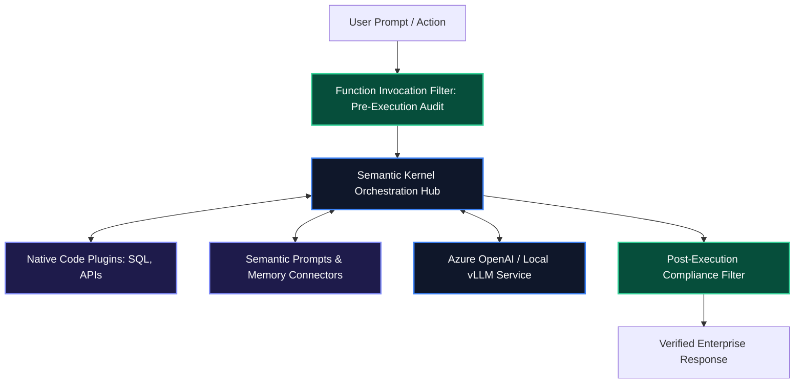

# Microsoft Semantic Kernel Architecture Guide: Enterprise AI Integration

When deploying generative AI within large enterprise systems (such as Azure environments, Microsoft 365 ecosystems, or legacy .NET backends), developer teams need enterprise-grade telemetry, native C# and Python parity, and formal plugin management.

**Semantic Kernel** is Microsoft's open-source enterprise SDK that integrates conventional programming code with LLM AI services using a centralized **Kernel orchestration hub**.

---

## 1. Core Architecture & Mental Model

Semantic Kernel models AI development through four core primitives:

1. **Kernel**: The central orchestration container holding registered AI services (Azure OpenAI, Hugging Face), memory stores, and plugins.
2. **Plugins & Native Functions**: Reusable skills that wrap conventional code (e.g. database access or math calculations) as callable tools.
3. **Semantic Functions**: Prompts written in natural language with variable templating (`{{$input}}`) registered directly into the Kernel.
4. **Function Filters & Middleware**: Enterprise hooks executed before and after every tool invocation (essential for compliance logging and PII redaction).



---

## 2. Installation & Quick Setup

```bash
# For Python
pip install semantic-kernel

# For .NET / C#
dotnet add package Microsoft.SemanticKernel
```

---

## 3. Recommended Production Folder Structure

```text
src/
├── plugins/
│   ├── NativePlugins/       # Python/C# native business logic
│   └── SemanticPrompts/     # Directory of yaml/txt prompt definitions
├── filters/
│   └── complianceFilter.py  # Audit logging & PII redaction middleware
├── kernel.py                # Kernel initialization & service registration
└── main.py
```

---

## 4. Complete, Runnable Starter Project in Python

Below is a complete Python implementation demonstrating Kernel initialization, native plugin registration, and automated function calling:

```python
import asyncio
from semantic_kernel import Kernel
from semantic_kernel.connectors.ai.open_ai import OpenAIChatCompletion
from semantic_kernel.functions import kernel_function

# 1. Define Native Plugin Class
class InfrastructurePlugin:
    @kernel_function(
        name="get_node_telemetry",
        description="Returns CPU and Memory utilization for a cloud instance."
    )
    def get_node_telemetry(self, node_id: str) -> str:
        return f"Node {node_id}: CPU=42.1%, RAM=6.2GB/16GB, Status=HEALTHY"

async def main():
    # 2. Initialize Central Kernel
    kernel = Kernel()

    # 3. Add AI Chat Service
    ai_service = OpenAIChatCompletion(
        service_id="openai_chat",
        ai_model_id="gpt-4o-mini",
    )
    kernel.add_service(ai_service)

    # 4. Register Native Plugin
    kernel.add_plugin(InfrastructurePlugin(), plugin_name="InfraManager")

    # 5. Execute Prompt with Automated Tool Invocation
    prompt = "Check the health of node 'srv-us-west-2' and summarize status."
    
    # Configure tool execution settings
    settings = kernel.get_prompt_execution_settings_from_service_id("openai_chat")
    settings.function_choice_behavior = "auto"

    result = await kernel.invoke_prompt(
        prompt=prompt,
        settings=settings,
    )

    print(f"Kernel Result:\n{result}")

if __name__ == "__main__":
    asyncio.run(main())
```

---

## 5. Architectural Tradeoffs Matrix

| Feature | Generic Frameworks | Microsoft Semantic Kernel |
| :--- | :--- | :--- |
| **Language Ecosystem** | Python-centric | **First-Class .NET / C# and Python Parity** |
| **Enterprise Middleware** | Ad-hoc hooks | **Standardized `FunctionInvocationFilter` Pipeline** |
| **Cloud Alignment** | Generic Cloud | **Deep Native Azure OpenAI & Microsoft 365 Integrations** |
| **Plugin Packaging** | Framework-specific | **OpenAPI & Standardized Semantic Plugin Folders** |

---

## 6. When to Use vs. When to Avoid

### Choose Semantic Kernel When:
- You are building enterprise AI services in C# / .NET or hybrid C#+Python environments.
- You require enterprise governance hooks (function invocation filters for PII scrubbing and compliance audit logging).

### Avoid Semantic Kernel When:
- You are building lightweight frontend React streaming applications (use **Vercel AI SDK** instead).
