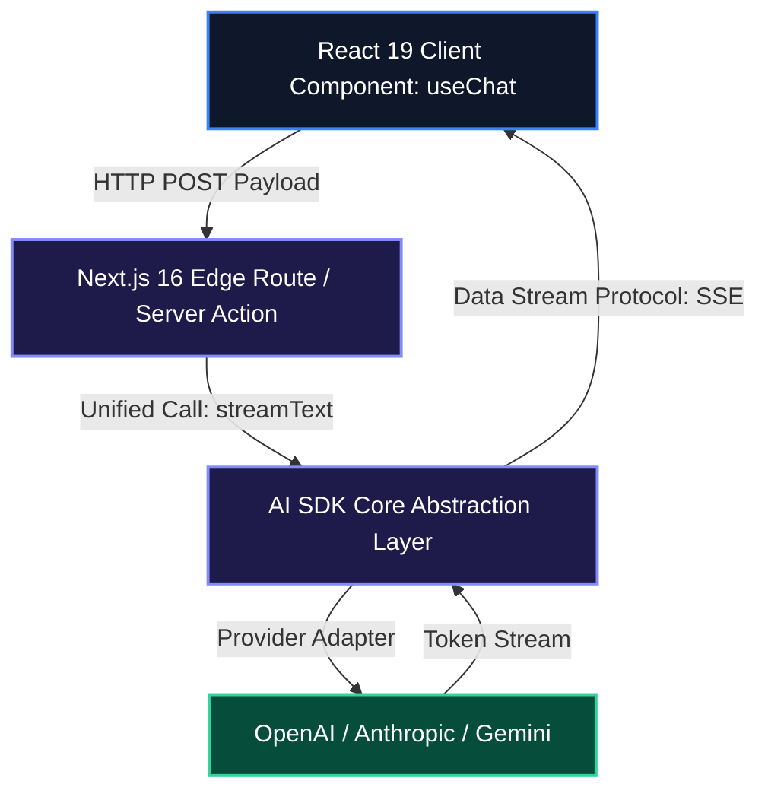

# Vercel AI SDK 4.0 Architecture Guide: Edge Streaming and Generative UI

Building full-stack AI web applications in Next.js, Svelte, or Nuxt often leads to SDK sprawl: OpenAI, Anthropic, Google Gemini, and Mistral all expose completely different client parameters, streaming interfaces, and error schemas.

**Vercel AI SDK 4.0** provides a unified, provider-agnostic standard library for building streaming AI interfaces across two core layers:
1. **AI SDK Core**: Unified text generation, structured object extraction, and tool calling primitives (`generateText`, `streamText`, `generateObject`).
2. **AI SDK UI / RSC**: Native React hooks (`useChat`, `useCompletion`) and server component streaming (`createStreamableUI`).

---

## 1. Core Architecture & Mental Model



---

## 2. Installation & Quick Setup

Install the core library alongside your chosen provider adapters:

```bash
npm install ai @ai-sdk/openai @ai-sdk/anthropic zod
```

---

## 3. Recommended Production Folder Structure

```text
app/
├── api/
│   └── chat/
│       └── route.ts          # Edge streaming Route Handler
├── actions/
│   └── generativeUI.tsx      # Server Action streaming React widgets
├── components/
│   ├── ChatInterface.tsx     # Client UI with useChat hook
│   └── WeatherCard.tsx       # Streamed Generative UI component
└── layout.tsx
```

---

## 4. Complete, Runnable Starter Project in TypeScript

### Edge Route Handler (`app/api/chat/route.ts`):

```typescript
import { openai } from "@ai-sdk/openai";
import { streamText } from "ai";
import { z } from "zod";

export const runtime = "edge";

export async function POST(req: Request) {
  const { messages } = await req.json();

  const result = streamText({
    model: openai("gpt-4o-mini"),
    system: "You are a senior software architect providing concise technical advice.",
    messages,
    tools: {
      checkDatabaseHealth: {
        description: "Checks active database connection pool latency.",
        parameters: z.object({ poolId: z.string() }),
        execute: async ({ poolId }) => {
          return { poolId, status: "HEALTHY", p95LatencyMs: 4.2 };
        },
      },
    },
    temperature: 0.2,
  });

  return result.toDataStreamResponse();
}
```

### Client Chat Component (`app/components/ChatInterface.tsx`):

```tsx
"use client";

import { useChat } from "ai/react";

export function ChatInterface() {
  const { messages, input, handleInputChange, handleSubmit, isLoading } = useChat();

  return (
    <div className="flex flex-col h-[500px] border border-slate-800 rounded-lg bg-slate-950 p-4">
      <div className="flex-1 overflow-y-auto space-y-3">
        {messages.map((m) => (
          <div
            key={m.id}
            className={`p-3 rounded text-sm ${
              m.role === "user" ? "bg-blue-600/20 text-blue-200 ml-8" : "bg-slate-900 text-slate-200 mr-8"
            }`}
          >
            <div className="font-mono text-xs text-slate-400 mb-1">{m.role.toUpperCase()}</div>
            {m.content}
          </div>
        ))}
      </div>

      <form onSubmit={handleSubmit} className="flex space-x-2 mt-4">
        <input
          value={input}
          onChange={handleInputChange}
          placeholder="Ask a question..."
          className="flex-1 bg-slate-900 border border-slate-800 rounded px-3 py-2 text-sm text-slate-100"
        />
        <button
          type="submit"
          disabled={isLoading}
          className="bg-blue-600 hover:bg-blue-500 text-white text-sm px-4 py-2 rounded"
        >
          Send
        </button>
      </form>
    </div>
  );
}
```

---

## 5. Architectural Tradeoffs Matrix

| Feature | Standard Direct SDK (e.g. `openai`) | Vercel AI SDK 4.0 |
| :--- | :--- | :--- |
| **Multi-Provider Portability** | Vendor lock-in | **Unified API across OpenAI, Anthropic, Gemini, Ollama** |
| **React Integration** | Manual `fetch()` + `ReadableStream` reader | **One-line `useChat()` and `useCompletion()` hooks** |
| **Generative UI** | Complex custom websocket / JSON parsing | **First-class server-to-client component streaming** |
| **Structured Output** | Custom Pydantic/Zod glue code | **Built-in `generateObject` with Zod validation** |

---

## 6. When to Use vs. When to Avoid

### Choose Vercel AI SDK When:
- You are building React, Next.js, Svelte, or Nuxt web applications requiring real-time token streaming.
- You want to switch between OpenAI, Anthropic, and open-weights models without rewriting prompt calling code.

### Avoid Vercel AI SDK When:
- You are building backend Python microservices or multi-agent graph state machines (use **Pydantic AI** or **LangGraph** instead).
