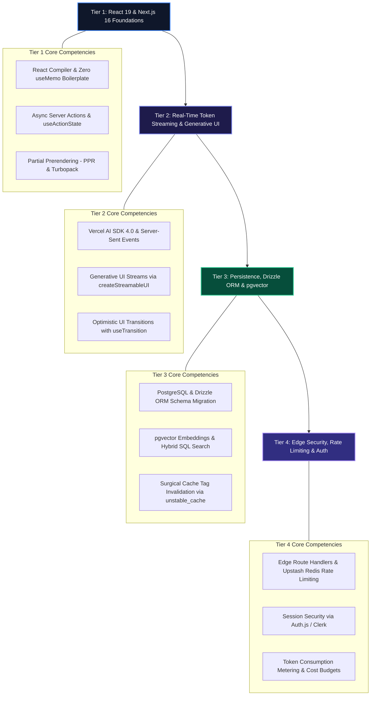

# The 2026 Full-Stack AI Developer Roadmap: Next.js 16, React 19 & Generative UI

Building modern web applications has fundamentally shifted. Traditional Single Page Applications (SPAs) that fetch unstructured text over REST APIs and render client-side loaders have been replaced by **server-rendered, streaming AI interfaces**.

Full-stack engineers in 2026 are expected to master sub-millisecond edge Time-to-First-Byte (TTFB), dynamic Partial Prerendering (PPR), token streaming via Server-Sent Events (SSE), and yielding interactive React components directly from server-side LLM tool calls.

This roadmap outlines the architectural progression from standard React/TypeScript development to building enterprise-grade full-stack AI web applications.

> [!NOTE]
> Full-Stack AI engineering is not about pasting OpenAI API keys into client components. It requires robust server-side validation, secure Edge proxy boundaries, fine-grained cache invalidation, and resilient token streaming pipelines.

---

## The 4-Tier Full-Stack AI Mental Model



---

## Tier 1: Modern React 19 & Next.js 16 App Router Architecture

Before adding AI primitives, master the modernized rendering and execution lifecycle in Next.js 16 and React 19:

### Core Milestones:
1. **React Compiler Memoization**: Automatic dependency tracking eliminates manual `useMemo` and `useCallback` calls.
2. **Async Server Actions**: Progressive form enhancement using `useActionState` and direct database/SDK calls without boilerplate `POST /api` routes.
3. **Partial Prerendering (PPR)**: Combining static CDN edge shells with dynamically streamed Suspense subtrees in a single HTTP response.

```typescript
// app/actions/posts.ts
"use server";

import { z } from "zod";
import { revalidateTag } from "next/cache";

const CreatePostSchema = z.object({
  title: z.string().min(5).max(120),
  category: z.string(),
});

export async function createPostAction(prevState: any, formData: FormData) {
  const parsed = CreatePostSchema.safeParse({
    title: formData.get("title"),
    category: formData.get("category"),
  });

  if (!parsed.success) {
    return { success: false, errors: parsed.error.flatten().fieldErrors };
  }

  // Execute database write and surgical cache invalidation
  revalidateTag("posts-feed");
  return { success: true };
}
```

📖 **Deep Dive Article**: [Next.js 16 App Router & Turbopack Deep Dive](/posts/nextjs-16-mastery)

---

## Tier 2: Real-Time Token Streaming & Generative UI

Users will not wait 10 seconds for an LLM to generate a complete response before seeing UI updates. Stream tokens over HTTP/2 and yield structured interactive widgets.

### Core Milestones:
1. **Edge Route Streaming**: Using `streamText` from Vercel AI SDK 4.0 on edge runtimes (`export const runtime = "edge"`).
2. **Generative Component Streaming**: Using `createStreamableUI` to stream live React components (charts, metric cards, code editors) during tool execution.
3. **Optimistic State Updates**: Coordinating `useOptimistic` and `useTransition` to maintain responsive form inputs during active token generation.

```tsx
// app/actions/streamUI.tsx
"use server";

import { createStreamableUI } from "ai/rsc";
import { openai } from "@ai-sdk/openai";
import { generateText } from "ai";
import { z } from "zod";

export async function executeGenerativeCommand(userPrompt: string) {
  const ui = createStreamableUI(
    <div className="p-3 rounded bg-slate-900 text-slate-400 text-xs animate-pulse">
      Synthesizing server component...
    </div>
  );

  (async () => {
    await generateText({
      model: openai("gpt-4o-mini"),
      prompt: userPrompt,
      tools: {
        renderLiveMetrics: {
          description: "Streams dynamic infrastructure metric cards.",
          parameters: z.object({ serverId: z.string(), cpuUsage: z.number() }),
          execute: async ({ serverId, cpuUsage }) => {
            ui.update(
              <div className="p-4 bg-slate-900 border border-emerald-500/40 rounded-lg">
                <span className="font-mono text-xs text-emerald-400">Server: {serverId}</span>
                <div className="text-lg font-bold text-slate-100 mt-1">CPU Load: {cpuUsage}%</div>
              </div>
            );
            return { status: "rendered" };
          },
        },
      },
    });
    ui.done();
  })();

  return { display: ui.value };
}
```

📖 **Deep Dive Article**: [Next.js 16 & React 19 AI Streaming Architecture](/posts/nextjs-16-react-19-streaming)

---

## Tier 3: PostgreSQL, Drizzle ORM & pgvector Persistence

Enterprise AI applications require unified transactional SQL data combined with high-dimensional vector embeddings in the same ACID database:

### Core Milestones:
1. **Drizzle ORM Integration**: Type-safe schema definition and zero-overhead SQL querying.
2. **`pgvector` Extension**: Storing embeddings (`vector(1536)`) and executing HNSW approximate nearest neighbor queries alongside standard relational `WHERE` clauses.
3. **Surgical Cache Invalidation**: Using `unstable_cache` with tag-based invalidation (`revalidateTag`) to keep edge caches fresh without database polling.

```typescript
// db/schema.ts
import { pgTable, text, timestamp, vector, index } from "drizzle-orm/pg-core";

export const documentsTable = pgTable(
  "documents",
  {
    id: text("id").primaryKey(),
    content: text("content").notNull(),
    embedding: vector("embedding", { dimensions: 1536 }),
    createdAt: timestamp("created_at").defaultNow(),
  },
  (table) => [
    index("embedding_hnsw_idx").using("hnsw", table.embedding.op("vector_cosine_ops")),
  ]
);
```

📖 **Deep Dive Article**: [High-Performance Vector Databases: Pinecone vs Qdrant vs Pgvector](/posts/vector-databases)

---

## Tier 4: Edge Security, Token Metering & Rate Limiting

Deploying public AI streaming endpoints without strict perimeter defenses leads to prompt injection attacks and runaway API bills.

### Core Milestones:
1. **Sliding Window Rate Limiting**: Implementing `@upstash/ratelimit` on Next.js Edge Middleware to cap requests per user session.
2. **Authentication & Identity**: Enforcing route-level session protection via Auth.js (NextAuth v5) or Clerk.
3. **Token Usage Metering**: Tracking token consumption per user ID in Redis and enforcing monthly spend limits.

```typescript
// middleware.ts
import { NextResponse } from "next/server";
import type { NextRequest } from "next/server";
import { Ratelimit } from "@upstash/ratelimit";
import { Redis } from "@upstash/redis";

const ratelimit = new Ratelimit({
  redis: Redis.fromEnv(),
  limiter: Ratelimit.slidingWindow(20, "1 m"), // 20 requests per minute
});

export async function middleware(req: NextRequest) {
  const ip = req.headers.get("x-forwarded-for") ?? "127.0.0.1";
  const { success, limit, remaining } = await ratelimit.limit(`ratelimit_${ip}`);

  if (!success) {
    return new NextResponse("Rate limit exceeded. Please wait.", { status: 429 });
  }

  return NextResponse.next();
}

export const config = {
  matcher: ["/api/chat/:path*", "/api/generate/:path*"],
};
```

---

## Full-Stack Capability Matrix

| Architecture Tier | Primary Technologies | Core Deliverable |
| :--- | :--- | :--- |
| **Tier 1: Foundations** | Next.js 16, React 19, Turbopack | PPR Static/Dynamic Hybrid Application |
| **Tier 2: Streaming** | Vercel AI SDK 4.0, Server-Sent Events | Sub-50ms Generative UI Stream Console |
| **Tier 3: Persistence** | PostgreSQL, Drizzle ORM, `pgvector` | Hybrid Relational & Vector Search Store |
| **Tier 4: Production SRE** | Upstash Redis, Auth.js, Zod | Rate-Limited & Metered Edge AI Endpoint |

---

## Recommended Learning Sequence

Follow our structured playlists to master this stack:

1. **[Fullstack Web & AI Series](/playlists/fullstack-web-and-ai)**: Core Next.js 16 and React 19 streaming mechanics.
2. **[AI Engineer Roadmap](/playlists/ai-engineer-roadmap)**: Foundations, Prompt Contracts, and Advanced RAG.
3. **[Multi-Agent Framework Masterclass](/playlists/multi-agent-framework-masterclass)**: State machines and tool calling.
