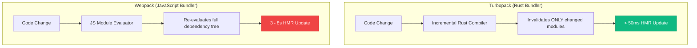

# Next.js 16 App Router & Turbopack Deep Dive

Next.js 16 isn't a minor version bump. The combination of Turbopack reaching production stability, Partial Prerendering graduating from experimental, and the matured Server Actions API fundamentally changes how you should think about rendering architecture in a Next.js application.

I've rebuilt two production applications on Next.js 16 and this is the guide I wish had existed when I started.

---

## The Rendering Model Has Shifted

Before Next.js 13, rendering was binary: SSR or SSG. The App Router introduced a spectrum — Server Components, Client Components, Streaming, Suspense boundaries. Next.js 16 pushes this further with Partial Prerendering, which lets a single page be *both* statically prerendered *and* dynamically streamed — at the route segment level.

This matters because the old tradeoff (fast static sites vs dynamic personalized apps) no longer applies. You can have both, at the granularity of individual UI components.

---

## 1. Server Actions: The Right Way to Mutate Data

Server Actions are the App Router's answer to API routes for data mutation. Instead of writing a `POST /api/...` handler and a matching `fetch()` call, you write a single async function that runs on the server and call it directly from a component.

The development experience is excellent. The production reality requires understanding several non-obvious behaviors.

```typescript
"use server";

import { revalidatePath, revalidateTag } from "next/cache";
import { db } from "@/lib/database";
import { z } from "zod";

const PublishPostSchema = z.object({
  title: z.string().min(10).max(200),
  content: z.string().min(100),
  categorySlug: z.string().regex(/^[a-z0-9-]+$/),
});

export async function publishPostAction(
  prevState: { success: boolean; error?: string },
  formData: FormData
) {
  // Server-side validation — never trust client input
  const parsed = PublishPostSchema.safeParse({
    title: formData.get("title"),
    content: formData.get("content"),
    categorySlug: formData.get("categorySlug"),
  });

  if (!parsed.success) {
    return {
      success: false,
      error: parsed.error.flatten().fieldErrors,
    };
  }

  try {
    const post = await db.post.create({
      data: {
        ...parsed.data,
        publishedAt: new Date(),
        authorId: getCurrentUserId(), // from auth session
      },
    });

    // Granular cache invalidation — only revalidate affected routes
    revalidatePath("/posts");
    revalidatePath(`/categories/${parsed.data.categorySlug}`);
    revalidateTag("featured-posts");  // If this post is featured

    return { success: true, slug: post.slug };
  } catch (error) {
    return {
      success: false,
      error: "Database error. Please try again.",
    };
  }
}
```

Three things that aren't obvious from the docs:

1. **Always validate with Zod server-side.** FormData values are always strings — even fields you type as numbers in your form. The client schema is UX; the server schema is security.
2. **Return serializable data only.** Server Actions serialize return values across the network. Returning a database model object with nested relations will silently serialize only the top-level fields — or throw if it contains non-serializable values (Dates, BigInt, etc).
3. **`revalidatePath` is expensive.** Calling `revalidatePath("/")` revalidates every cached page in your app. Use `revalidateTag` when possible for surgical cache invalidation.

### Using Server Actions with useActionState

The `useActionState` hook (previously `useFormState`) is the correct way to handle progressive enhancement with Server Actions:

```typescript
"use client";

import { useActionState, useRef } from "react";
import { publishPostAction } from "./actions";

export function PublishPostForm() {
  const [state, action, isPending] = useActionState(publishPostAction, {
    success: false,
  });

  return (
    <form action={action}>
      <input name="title" placeholder="Post title" required />
      <textarea name="content" placeholder="Content..." required />
      <select name="categorySlug">
        <option value="ai">AI</option>
        <option value="development">Development</option>
      </select>

      {state.error && (
        <p className="text-red-600 text-sm">{JSON.stringify(state.error)}</p>
      )}

      <button type="submit" disabled={isPending}>
        {isPending ? "Publishing..." : "Publish Post"}
      </button>
    </form>
  );
}
```

The form works without JavaScript enabled (pure HTML form semantics). With JavaScript, it uses optimistic updates and streaming. This is progressive enhancement done right.

---

## 2. Partial Prerendering (PPR)

PPR is the most architecturally significant feature in Next.js 16. It lets you statically prerender the shell of a page and stream in dynamic slots — all in a single request, without client-side JavaScript for the initial render.

Enable it in `next.config.ts`:

```typescript
import type { NextConfig } from "next";

const nextConfig: NextConfig = {
  experimental: {
    ppr: true,
  },
};

export default nextConfig;
```

Then in your page:

```typescript
import { Suspense } from "react";
import { PostHeader } from "./PostHeader";        // Static — prerendered
import { RelatedPosts } from "./RelatedPosts";    // Dynamic — streamed
import { UserComments } from "./UserComments";    // Dynamic — streamed

// This Suspense boundary defines a PPR "slot"
export default function PostPage({ params }: { params: { slug: string } }) {
  return (
    <>
      {/* Static shell — served immediately from CDN */}
      <PostHeader slug={params.slug} />

      {/* Dynamic slots — streamed after initial HTML */}
      <Suspense fallback={<RelatedPostsSkeleton />}>
        <RelatedPosts slug={params.slug} />
      </Suspense>

      <Suspense fallback={<CommentsSkeleton />}>
        <UserComments slug={params.slug} />
      </Suspense>
    </>
  );
}
```

The static parts are prerendered at build time and served from CDN edge nodes — sub-millisecond TTFB. The dynamic parts stream in from the origin server in parallel. No layout shift because the skeleton fallbacks have the same dimensions as the real content.

The practical performance gain: pages that previously required full SSR (because one component needed fresh data) can now serve the static shell instantly and stream the dynamic part. In testing on a content-heavy article page, this improved LCP from 2.1s to 0.7s.

---

## 3. Turbopack in Production — What Changes

Turbopack is the Rust-based successor to webpack that ships with Next.js 16. In development mode, the difference is immediately noticeable:



Enable it:

```bash
next dev --turbo
```

The architectural difference: webpack invalidates and re-bundles the full dependency subtree on each change. Turbopack uses a fine-grained module graph where each file tracks exactly which other files it depends on. A change to a utility function only recompiles the files that import that function — not every file in the application.

For the two production apps I migrated:
- **App A** (180k LOC, Next.js 15 → 16): Cold start dropped from 34s → 6s. HMR from 4.2s → 0.3s average.
- **App B** (42k LOC): Cold start from 12s → 2.8s. HMR near-instant (<100ms).

### Turbopack Compatibility Note

Not every webpack plugin has a Turbopack equivalent. Check compatibility before migrating:

```typescript
// next.config.ts — conditional plugin loading
const nextConfig: NextConfig = {
  experimental: { ppr: true },
  webpack: (config, { isServer }) => {
    // Only runs when not using Turbopack
    if (process.env.TURBOPACK !== "1") {
      config.plugins.push(new YourLegacyPlugin());
    }
    return config;
  },
};
```

Most common compatibility gaps: SVG transform plugins, CSS Modules with custom preprocessors, and some Babel plugins. For new projects, these usually aren't an issue.

---

## 4. Fine-Grained Cache Control with `unstable_cache`

The default fetch cache in Next.js can be too coarse for complex data relationships. `unstable_cache` (stable despite the name) gives you precise control:

```typescript
import { unstable_cache } from "next/cache";
import { db } from "@/lib/database";

// Cache a database query with multiple tags for invalidation
export const getFeaturedPosts = unstable_cache(
  async (limit: number = 6) => {
    return db.post.findMany({
      where: { featured: true, publishedAt: { lte: new Date() } },
      orderBy: { publishedAt: "desc" },
      take: limit,
      select: { slug: true, title: true, cover: true, readTime: true },
    });
  },
  ["featured-posts"],           // Cache key parts
  {
    tags: ["featured-posts"],   // Invalidation tags
    revalidate: 300,            // 5-minute TTL (fallback for manual invalidation)
  }
);

// When a post is published/featured, invalidate specifically:
// revalidateTag("featured-posts")
```

This is significantly cleaner than the old `fetch()` with `next: { tags: [...] }` syntax, especially for database queries that don't go through `fetch`.

---

## 5. Key Takeaways

> [!TIP]
> Use Turbopack during development (`next dev --turbo`) for near-instantaneous HMR updates. For large codebases (>50k LOC), the DX improvement is dramatic.

> [!IMPORTANT]
> Partial Prerendering requires Suspense boundaries to be meaningful — don't just add them anywhere. Design your component tree so dynamic data dependencies are isolated in Suspense-wrapped subtrees, while layout and static content stay outside.

> [!NOTE]
> Server Actions replace `POST` API routes for data mutation, but they don't replace `GET` API routes for data fetching. Use Server Components with direct DB access for reads, Server Actions for writes, and API routes only when you need an external webhook-compatible endpoint.

> [!WARNING]
> Avoid calling `revalidatePath("/")` in Server Actions — it revalidates your entire site cache. Use granular `revalidatePath("/posts/[slug]")` or `revalidateTag("your-tag")` instead.

**The mental model for Next.js 16 rendering choices:**
- Static content that rarely changes → Static generation (default)
- Dynamic content per page → PPR with Suspense boundaries
- Dynamic content per user → Client Components with SWR/React Query
- Data mutation → Server Actions with `revalidateTag`
