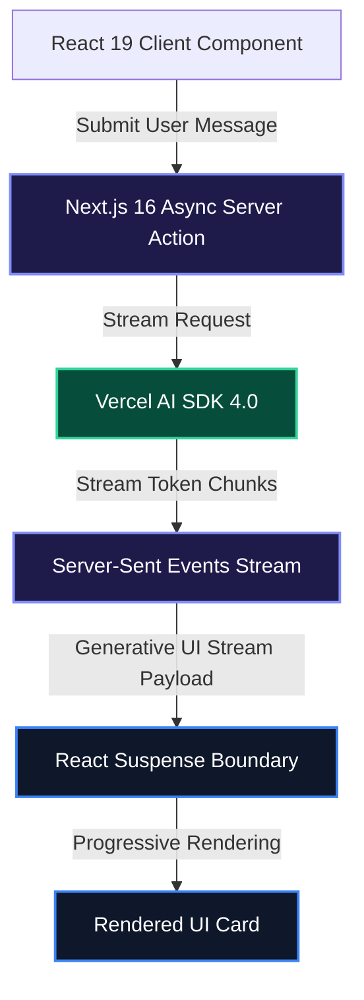

The release of **Next.js 16** alongside **React 19** marks a major shift in modern fullstack web architecture. Streaming responses, server-rendered AI interfaces, and generative UI are no longer experimental novelties—they are standard expectations for modern web applications.

In this deep dive, we explore how to build high-performance AI streaming interfaces using **React 19 Server Components**, the **React Compiler**, **Vercel AI SDK 4.0**, and Next.js 16 dynamic proxy boundaries.

> [!NOTE]
> React 19 introduces automatic component memoization via the React Compiler and native support for Async Server Actions, eliminating manual `useMemo` and `useCallback` boilerplate across streaming UI trees.

---

## 1. Modern Architecture: Streaming Server-Sent Events (SSE)

Instead of waiting for an entire LLM completion before updating the client UI, Next.js 16 streams text chunks and structured component payloads directly over HTTP/2 using Server-Sent Events.



---

## 2. Setting Up Next.js 16 API Proxy & Route Handlers

Next.js 16 simplifies edge endpoint configuration. Here is an optimized API route handler leveraging edge runtimes and OpenAI streaming models.

```typescript
// app/api/chat/route.ts
import { openai } from "@ai-sdk/openai";
import { streamText } from "ai";

// Specify Next.js 16 Edge runtime configuration
export const runtime = "edge";
export const maxDuration = 30;

export async function POST(req: Request) {
  const { messages } = await req.json();

  // Create streaming LLM response pipe
  const result = streamText({
    model: openai("gpt-4o-mini"),
    system: "You are a senior fullstack engineering consultant for Sidhya Blog.",
    messages,
    temperature: 0.7,
  });

  // Convert output stream directly to Response headers
  return result.toDataStreamResponse();
}
```

---

## 3. Building Streaming UI with React 19 `useActionState` and `useChat`

React 19 hooks seamlessly manage async server state, optimistic UI updates, and pending states without triggering layout thrashing.

```tsx
"use client";

import { useChat } from "ai/react";
import { useTransition } from "react";

export default function StreamingChatInterface() {
  const { messages, input, handleInputChange, handleSubmit, isLoading } = useChat({
    api: "/api/chat",
  });
  const [isPending, startTransition] = useTransition();

  return (
    <div className="flex flex-col h-screen max-w-4xl mx-auto p-6 space-y-4">
      <header className="border-b pb-4">
        <h1 className="text-2xl font-bold text-slate-100">AI Streaming Console</h1>
        <p className="text-sm text-slate-400">Powered by Next.js 16 & React 19</p>
      </header>

      {/* Message Feed */}
      <div className="flex-1 overflow-y-auto space-y-4">
        {messages.map((message) => (
          <div
            key={message.id}
            className={`p-4 rounded-lg text-sm ${
              message.role === "user"
                ? "bg-blue-600/20 border border-blue-500/30 text-blue-100 self-end"
                : "bg-slate-800/60 border border-slate-700 text-slate-200"
            }`}
          >
            <span className="font-semibold block mb-1">
              {message.role === "user" ? "Developer" : "Sidhya AI"}
            </span>
            <div className="whitespace-pre-wrap">{message.content}</div>
          </div>
        ))}
        {isLoading && (
          <div className="p-3 text-xs text-emerald-400 animate-pulse">
            ⚡ Sidhya AI is generating streaming tokens...
          </div>
        )}
      </div>

      {/* Input Action Bar */}
      <form
        onSubmit={(e) => {
          e.preventDefault();
          startTransition(() => {
            handleSubmit(e);
          });
        }}
        className="flex space-x-2"
      >
        <input
          value={input}
          onChange={handleInputChange}
          placeholder="Ask a technical architecture question..."
          className="flex-1 bg-slate-900 border border-slate-800 rounded-md px-4 py-2 text-sm text-slate-100 focus:outline-none focus:ring-2 focus:ring-blue-500"
        />
        <button
          type="submit"
          disabled={isLoading || isPending}
          className="bg-blue-600 hover:bg-blue-500 disabled:opacity-50 text-white font-medium text-sm px-5 py-2 rounded-md transition-colors"
        >
          Send
        </button>
      </form>
    </div>
  );
}
```

---

## 4. Generative UI: Streaming React Components from Server Actions

With Vercel AI SDK 4.0 and Next.js 16, models can return dynamic React UI components directly rather than plain markdown text.

> [!TIP]
> Use `streamUI` to yield custom React components (such as weather cards, code previewers, or benchmark charts) based on model tool calls.

```tsx
// app/actions/streamUI.tsx
"use server";

import { createStreamableUI } from "ai/rsc";
import { openai } from "@ai-sdk/openai";
import { generateText } from "ai";
import { z } from "zod";

export async function submitUserMessage(userInput: string) {
  const uiStream = createStreamableUI(
    <div className="p-4 bg-slate-800 text-slate-400 rounded-md">Analyzing prompt...</div>
  );

  // Execute background stream execution
  (async () => {
    // Dynamic Tool Calling for Generative UI
    uiStream.update(
      <div className="p-4 bg-slate-900 border border-emerald-500/40 rounded-lg">
        <h3 className="text-emerald-400 font-bold mb-2">🚀 Execution Result</h3>
        <p className="text-slate-300 text-sm">Successfully rendered server component stream for: {userInput}</p>
      </div>
    );
    uiStream.done();
  })();

  return { id: Date.now(), display: uiStream.value };
}
```

---

## 5. Performance & DX Feature Matrix

| Feature | Next.js 14 / React 18 | Next.js 16 / React 19 |
| :--- | :--- | :--- |
| **Component Optimization** | Manual `useMemo` / `useCallback` | Automatic React Compiler Memoization |
| **Streaming UI** | Heavy client hydration bundle | Server Components + Suspense Boundaries |
| **Network Security** | Custom API middleware routing | Explicit `proxy.ts` network boundaries |
| **Form Handling** | Manual `useState` tracking | Native Async `useActionState` |
| **AI SDK Integration** | Text-only streaming primitives | Native Generative UI & Tool Rendering |

> [!WARNING]
> Always secure public Edge route handlers with rate-limiting middleware (such as `@upstash/ratelimit`) to prevent API abuse during high-concurrency streaming events.

---

## Key Takeaways

- **React Compiler Advantage**: Automatic memoization reduces unnecessary re-renders in streaming UI trees.
- **Server Action Efficiency**: Async Server Actions streamline form submissions without custom boilerplate fetch code.
- **Dynamic Generative UI**: Yielding styled React components directly from server tools creates interactive user experiences.
- **Edge Deployment**: Next.js 16 Edge runtime ensures minimal TTFB (Time To First Byte) for streaming completions globally.
