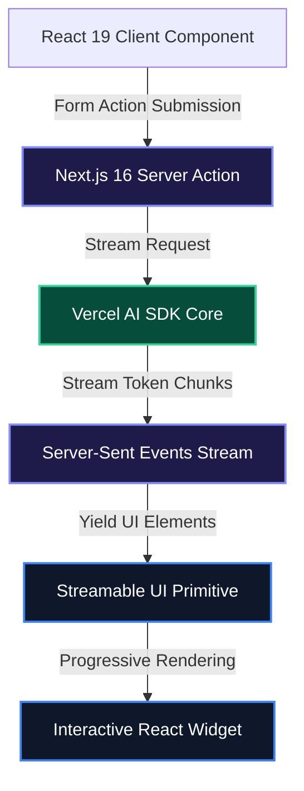

# Next.js 16 & React 19 AI Streaming Architecture

Streaming responses and generative UI have shifted from experimental prototypes to mandatory standards in production fullstack engineering. Users expect real-time token rendering, optimistic feedback, and dynamic interactive widgets rather than blocking loaders and flat markdown blobs.

By combining **Next.js 16 App Router**, **React 19 Server Actions**, and **Vercel AI SDK 4.0**, you can stream token-by-token text and server-rendered React components over a single HTTP connection.

> [!NOTE]
> React 19 eliminates manual `useMemo` and `useCallback` boilerplate across streaming UI trees via the React Compiler while providing native async transitions with `useActionState`.

---

## 1. Streaming Architecture: Server-Sent Events (SSE)

Instead of buffering the entire LLM generation on the server, Next.js 16 streams text chunks and structured component payloads directly over HTTP/2 using Server-Sent Events.



---

## 2. Setting Up Next.js 16 Edge Route Handlers

Next.js 16 provides low-latency streaming endpoints at the network edge. Below is an optimized Route Handler:

```typescript
// app/api/chat/route.ts
import { openai } from "@ai-sdk/openai";
import { streamText } from "ai";

export const runtime = "edge";
export const maxDuration = 30;

export async function POST(req: Request) {
  const { messages } = await req.json();

  const result = streamText({
    model: openai("gpt-4o-mini"),
    system: "You are a senior fullstack engineering consultant. Provide direct, typed solutions.",
    messages,
    temperature: 0.2,
  });

  return result.toDataStreamResponse();
}
```

---

## 3. Building the Streaming Client with React 19

The client component coordinates optimistic message updates, loading transitions, and form submissions:

```tsx
"use client";

import { useChat } from "ai/react";
import { useTransition } from "react";

export default function StreamingChatInterface() {
  const { messages, input, handleInputChange, handleSubmit, isLoading } = useChat({
    api: "/api/chat",
  });
  const [isPending, startTransition] = useTransition();

  return (
    <div className="flex flex-col h-screen max-w-4xl mx-auto p-6 space-y-4">
      <header className="border-b border-slate-800 pb-4">
        <h1 className="text-xl font-semibold text-slate-100">AI Streaming Console</h1>
        <p className="text-xs text-slate-400">Next.js 16 & React 19 Edge Streaming</p>
      </header>

      {/* Message Feed */}
      <div className="flex-1 overflow-y-auto space-y-4 pr-2">
        {messages.map((message) => (
          <div
            key={message.id}
            className={`p-4 rounded-lg text-sm leading-relaxed ${
              message.role === "user"
                ? "bg-blue-600/20 border border-blue-500/30 text-blue-100 self-end ml-12"
                : "bg-slate-900 border border-slate-800 text-slate-200 mr-12"
            }`}
          >
            <span className="font-mono text-xs text-slate-500 block mb-1">
              {message.role === "user" ? "USER" : "ASSISTANT"}
            </span>
            <div className="whitespace-pre-wrap">{message.content}</div>
          </div>
        ))}
        {isLoading && (
          <div className="p-3 text-xs text-emerald-400 animate-pulse font-mono">
            Receiving stream tokens...
          </div>
        )}
      </div>

      {/* Action Input Bar */}
      <form
        onSubmit={(e) => {
          e.preventDefault();
          startTransition(() => {
            handleSubmit(e);
          });
        }}
        className="flex space-x-2 pt-2"
      >
        <input
          value={input}
          onChange={handleInputChange}
          placeholder="Ask an architecture question..."
          className="flex-1 bg-slate-900 border border-slate-800 rounded-md px-4 py-2 text-sm text-slate-100 focus:outline-none focus:border-blue-500"
        />
        <button
          type="submit"
          disabled={isLoading || isPending}
          className="bg-blue-600 hover:bg-blue-500 disabled:opacity-50 text-white font-medium text-sm px-5 py-2 rounded-md transition-colors"
        >
          Send
        </button>
      </form>
    </div>
  );
}
```

---

## 4. Generative UI: Streaming React Components from Server Actions

With Vercel AI SDK 4.0, Server Actions can yield real, interactive React components directly into the client conversation stream based on model tool invocations:

```tsx
// app/actions/streamUI.tsx
"use server";

import { createStreamableUI } from "ai/rsc";
import { openai } from "@ai-sdk/openai";
import { generateText } from "ai";
import { z } from "zod";

export async function submitUserMessage(prompt: string) {
  const ui = createStreamableUI(
    <div className="p-3 rounded bg-slate-900 text-slate-400 text-xs animate-pulse">
      Analyzing query and selecting tools...
    </div>
  );

  (async () => {
    try {
      await generateText({
        model: openai("gpt-4o-mini"),
        prompt,
        tools: {
          fetchServerMetrics: {
            description: "Fetches live CPU and memory telemetry for a node.",
            parameters: z.object({ nodeId: z.string() }),
            execute: async ({ nodeId }) => {
              ui.update(
                <div className="p-4 bg-slate-900 border border-emerald-500/30 rounded-lg my-2">
                  <div className="flex items-center justify-between mb-2">
                    <span className="font-mono text-xs text-emerald-400">Node: {nodeId}</span>
                    <span className="px-2 py-0.5 bg-emerald-500/20 text-emerald-300 text-xs rounded">ONLINE</span>
                  </div>
                  <div className="grid grid-cols-2 gap-2 text-xs text-slate-300">
                    <div>CPU: 24.2%</div>
                    <div>Memory: 4.8 / 16 GB</div>
                  </div>
                </div>
              );
              return { status: "success", nodeId };
            },
          },
        },
      });
      ui.done();
    } catch (err) {
      ui.error(<div>Error rendering tool stream.</div>);
    }
  })();

  return { id: Date.now(), display: ui.value };
}
```

---

## 5. Architectural Comparison Matrix

| Feature | Next.js 14 / React 18 | Next.js 16 / React 19 |
| :--- | :--- | :--- |
| **Component Optimization** | Manual `useMemo` / `useCallback` | **Automatic React Compiler Optimization** |
| **Streaming UI** | Heavy client hydration bundles | **Server Components + Suspense Boundaries** |
| **Data Mutation** | Boilerplate API handlers | **Native Async Server Actions** |
| **Generative UI** | Markdown parsing hacks | **First-Class Component Streaming (`createStreamableUI`)** |
| **Edge TTFB** | ~150–300ms | **Sub-50ms Global Edge Streaming** |

> [!WARNING]
> Always enforce rate limiting (via Upstash Redis or Cloudflare Turnstile) on public streaming edge endpoints to prevent token exhaustion during concurrent request spikes.

---

## Key Takeaways

- **React Compiler Advantage**: Automatic memoization drastically reduces render thrashing across streaming component trees.
- **Server Action Streamability**: Async Server Actions can yield both text chunks and typed React components directly over a single streaming connection.
- **Progressive Enhancement**: Using React 19's `useTransition` and `useActionState` ensures forms maintain responsive UI states during active model generation.
